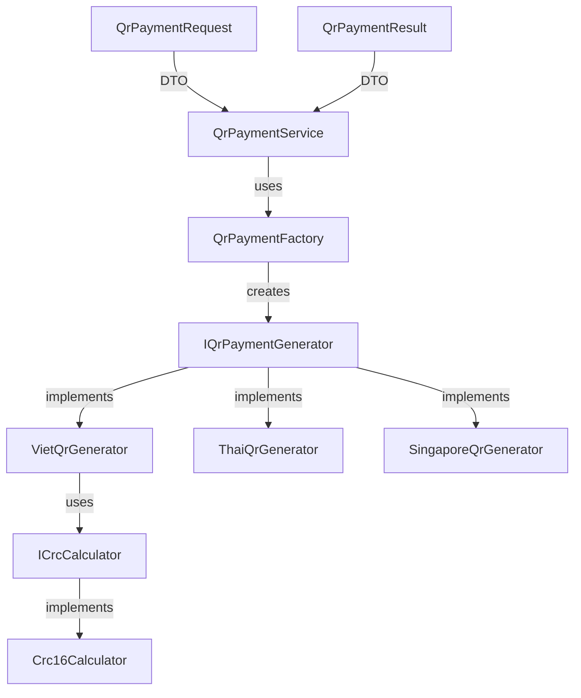

# QR Payment Library Implementation Plan

Create a modern, SOLID-based QR payment code generation library supporting multiple countries, ready for NuGet packaging.

## User Review Required

> [!IMPORTANT]
> **Multi-Country Support**: The initial implementation will include Vietnam (VietQR), with infrastructure ready to add more countries. Do you want specific countries included in the first release?

> [!IMPORTANT]
> **NuGet Package Naming**: Proposed package name is `Payment.QrPayload`. Do you want a different name or author information?

> [!IMPORTANT]
> **Target Framework**: Proposed to use `.NET Standard 2.0` for maximum compatibility. Should we also target `.NET 6.0` or `.NET 8.0`?

---

## Proposed Changes

The library will be refactored following SOLID principles with clear separation of concerns and extensibility for multiple countries.

### Architecture Overview

### Core Components

#### [NEW] [IQrPaymentGenerator.cs](file:///f:/an/payment/Anpero.PaymentHelper/Payment.QrPayload/Abstractions/IQrPaymentGenerator.cs)

**Interface Segregation Principle (ISP):** Core abstraction for QR payment generation
- `GenerateQrData(QrPaymentRequest)` method
- Country-agnostic contract

#### [NEW] [ICrcCalculator.cs](file:///f:/an/payment/Anpero.PaymentHelper/Payment.QrPayload/Abstractions/ICrcCalculator.cs)

**Single Responsibility Principle (SRP):** Dedicated CRC calculation interface
- `ComputeChecksum(string)` method
- `Validate(string)` method

---

### Models & DTOs

#### [NEW] [QrPaymentRequest.cs](file:///f:/an/payment/Anpero.PaymentHelper/Payment.QrPayload/Models/QrPaymentRequest.cs)

Request model containing:
- BankAccount, BankId
- Amount, Currency
- Message/Reference
- Country-specific parameters

#### [NEW] [QrPaymentResult.cs](file:///f:/an/payment/Anpero.PaymentHelper/Payment.QrPayload/Models/QrPaymentResult.cs)

Response model containing:
- Success status
- QR code data
- Validation result
- Error messages

#### [NEW] [CurrencyCode.cs](file:///f:/an/payment/Anpero.PaymentHelper/Payment.QrPayload/Models/CurrencyCode.cs)

ISO 4217 currency enum (copy from existing implementation)

#### [NEW] [CountryCode.cs](file:///f:/an/payment/Anpero.PaymentHelper/Payment.QrPayload/Models/CountryCode.cs)

ISO 3166-1 alpha-2 country codes enum

---

### Country-Specific Implementations

#### [NEW] [VietQrGenerator.cs](file:///f:/an/payment/Anpero.PaymentHelper/Payment.QrPayload/Generators/VietQrGenerator.cs)

**Single Responsibility Principle:** Vietnam QR code generation
- Based on existing `QRCodeGenerator.CreateQRCode` logic
- Implements VietQR standard (EMVCo QR specification)
- Uses CRC16 validation

#### [NEW] [ThaiQrGenerator.cs](file:///f:/an/payment/Anpero.PaymentHelper/Payment.QrPayload/Generators/ThaiQrGenerator.cs)

**Open/Closed Principle (OCP):** Thailand PromptPay QR generation
- Placeholder implementation ready for Thai standards
- Similar structure to VietQR for consistency

#### [NEW] [SingaporeQrGenerator.cs](file:///f:/an/payment/Anpero.PaymentHelper/Payment.QrPayload/Generators/SingaporeQrGenerator.cs)

**Open/Closed Principle (OCP):** Singapore SGQR generation
- Placeholder implementation ready for Singapore standards

---

### Factory & Service Layer

#### [NEW] [QrPaymentFactory.cs](file:///f:/an/payment/Anpero.PaymentHelper/Payment.QrPayload/Factories/QrPaymentFactory.cs)

**Dependency Inversion Principle (DIP) & OCP:** Factory for creating country-specific generators
- `CreateGenerator(CountryCode)` method
- Strategy pattern for country selection
- Easy to extend for new countries

#### [NEW] [QrPaymentService.cs](file:///f:/an/payment/Anpero.PaymentHelper/Payment.QrPayload/Services/QrPaymentService.cs)

**Facade pattern:** High-level service for QR generation
- `GenerateQrCode(QrPaymentRequest)` method
- Uses factory internally
- Main entry point for library consumers

---

### Utilities

#### [NEW] [Crc16Calculator.cs](file:///f:/an/payment/Anpero.PaymentHelper/Payment.QrPayload/Utilities/Crc16Calculator.cs)

**SRP:** CRC16-CCITT calculation (extracted from existing implementation)
- Polynomial 0x1021
- Used for QR code validation

#### [NEW] [QrDataBuilder.cs](file:///f:/an/payment/Anpero.PaymentHelper/Payment.QrPayload/Utilities/QrDataBuilder.cs)

**SRP:** Fluent builder for constructing QR data strings
- Methods for each EMVCo field
- Automatic length calculation
- Reusable across country implementations

---

### Configuration & Packaging

#### [MODIFY] [Payment.QrPayload.csproj](file:///f:/an/payment/Anpero.PaymentHelper/Payment.QrPayload/Payment.QrPayload.csproj)

Configure for NuGet packaging:
- Package metadata (title, description, author, version)
- License information
- Repository URL
- Tags for discoverability
- Icon/README embedding
- XML documentation generation
- SourceLink for debugging

#### [NEW] [README.md](file:///f:/an/payment/Anpero.PaymentHelper/Payment.QrPayload/README.md)

NuGet package documentation:
- Quick start guide
- Usage examples
- Supported countries
- API reference links

#### [NEW] [CHANGELOG.md](file:///f:/an/payment/Anpero.PaymentHelper/Payment.QrPayload/CHANGELOG.md)

Version history following semantic versioning

---

## SOLID Principles Applied

| Principle | Implementation |
|-----------|---------------|
| **SRP** | Each class has one reason to change: generators focus on QR generation, CRC calculator only handles checksums, models are pure data |
| **OCP** | Add new countries by implementing `IQrPaymentGenerator` without modifying existing code |
| **LSP** | All generators are substitutable through `IQrPaymentGenerator` interface |
| **ISP** | Small, focused interfaces: `IQrPaymentGenerator`, `ICrcCalculator` |
| **DIP** | High-level `QrPaymentService` depends on `IQrPaymentGenerator` abstraction, not concrete implementations |

---

## Verification Plan

### Automated Tests
Create unit test project to verify:
- Vietnam QR generation matches existing implementation
- CRC validation works correctly
- Factory creates correct generator for each country
- Invalid inputs are handled gracefully

### Manual Verification
1. Build NuGet package: `dotnet pack -c Release`
2. Test in [TestPayment](file:///f:/an/payment/Anpero.PaymentHelper/TestPayment) project
3. Verify generated QR codes with banking apps

### NuGet Package Structure
Verify package contains:
- ✅ XML documentation
- ✅ .NET Standard 2.0 DLL
- ✅ README displayed on NuGet.org
- ✅ Proper semantic versioning
